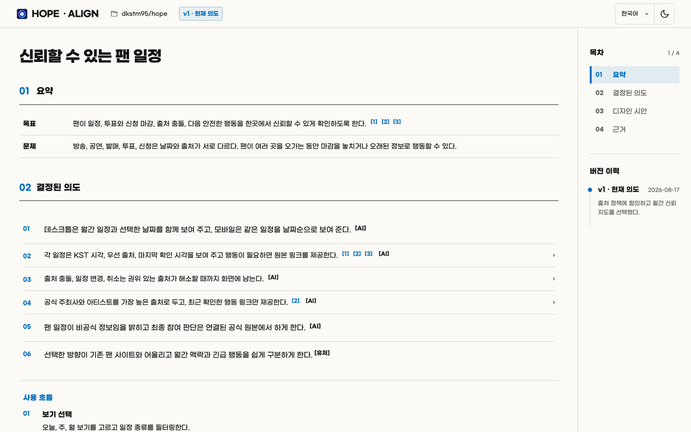
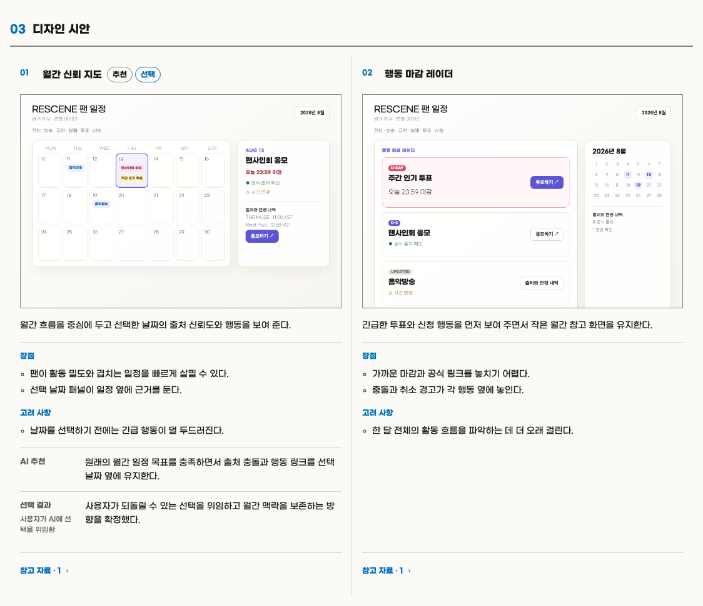
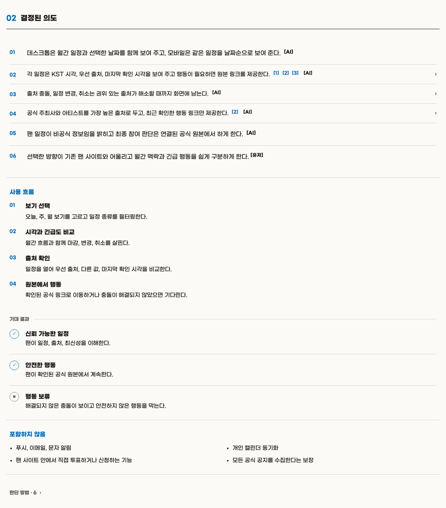
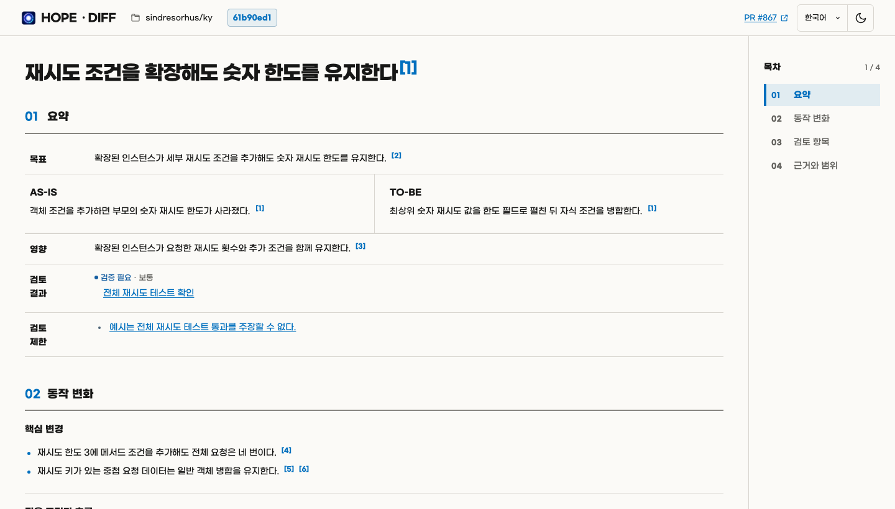
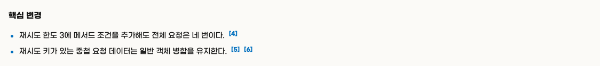
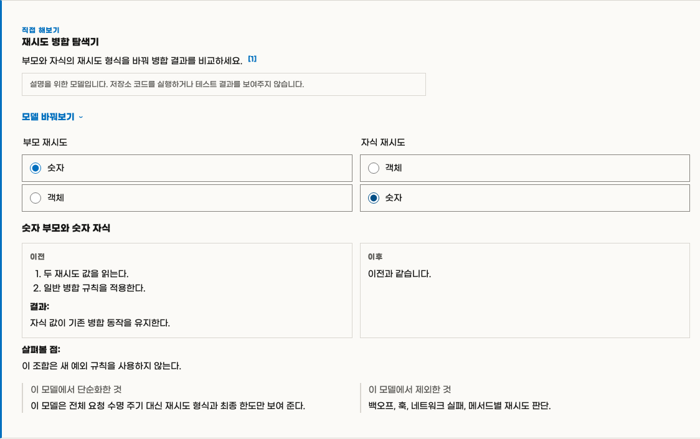
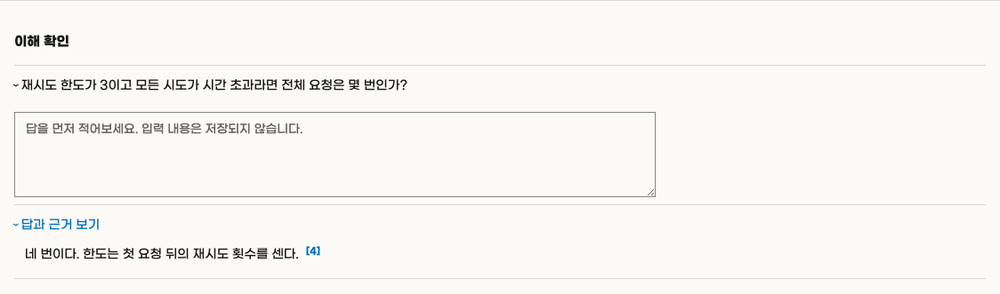

<p align="center">
  
</p>

<h1 align="center">Hope Commit</h1>

<p align="center">
  <strong>
    변경 불가능한 Git 커밋 하나를 근거가 연결된 오프라인 HTML로 검토하면서
    원본 Hope 기능도 함께 제공합니다.
  </strong>
</p>

<p align="center"><a href="README.md">English</a></p>

<br>

> [!NOTE]
> Hope Commit은 SeungIl이 만든 [Hope](https://github.com/dkstm95/hope)
> 6.0.0을 기준으로 만든 비공식 포크입니다. 원본 Git 이력과 MIT 라이선스를
> 보존하며, 원본 프로젝트가 이 포크를 공식적으로 보증하거나 유지보수하지는
> 않습니다.

## 기능

### 🧾 Commit Diff — 변경 불가능한 로컬 Git 커밋 하나를 검토합니다

Commit Diff는 16진수 커밋 ID를 받아 근거가 연결된 하나의 독립 실행형 오프라인
HTML 리뷰를 만듭니다. 기본적으로 첫 번째 부모와 비교하고, 병합 커밋에서는 부모를
직접 선택할 수 있으며, 루트 커밋은 Git의 빈 트리와 비교합니다.

수집기는 작업 디렉터리가 아니라 커밋된 Git 객체를 읽습니다. 따라서 staged,
unstaged, untracked 파일은 캡처한 리뷰에 영향을 주지 않습니다. 입력 크기 제한,
비밀정보 제외, 근거 검증, 임시 상태 소유권, 원자적 발행 보장도 유지합니다.

> [!IMPORTANT]
> 오프라인은 생성된 HTML을 네트워크 없이 읽을 수 있다는 뜻입니다. 리뷰를 만드는
> 동안 코드와 커밋 정보는 사용 중인 AI 서비스에서 처리될 수 있습니다. 비공개 코드를
> 검토하기 전에 해당 서비스의 데이터 정책과 조직의 코드 반출 기준을 확인하세요.

Commit Diff는 명시적으로 호출할 때만 실행합니다.

```text
이 저장소의 커밋 f6363ced를 $hope:commit으로 검토하고 한국어 HTML을 만들어줘.
```

---

### 🤝 Align — 구현 전 작업 이해를 맞추고 `의도 부채`를 방지합니다

Align은 확인 가능한 근거로 요청을 검토하고, 결과를 바꿀 수 있는 모든 중요한 의도 결정을 구조화한 뒤 의존 관계에 맞춰 라운드별로 인터뷰합니다. 답변할 때마다 남은 질문을 다시 계산하며, 중요한 결정이 하나도 남지 않고 전체 의도를 되가르친 내용에 사용자가 확인해야 끝납니다.

후속 작업이나 검토에서 합의한 의도를 다시 확인할 기록이 필요하거나 사용자가
산출물을 요청하면, Align은 프로젝트 안에 하나의 HTML 기록을 만듭니다. 현재
세션에서 계속 진행할 작고 명확한 일은 파일을 만들지 않고 합의를 대화에 남길 수
있습니다.

이 기록에는 합의한 목표 하나, 관찰 가능한 의도 충족 조건, 제외한 작업, 필요한
사용자 흐름이 담깁니다. 내부 설계, 구현 세부 사항, 현재 구현 상태, 완료 결과는 담지
않습니다. 후속 작업은 의도의 근거로 참고할 수 있지만 구현 계약이나 현재 시스템
명세로 취급하지 않습니다.

중요한 시각 선택을 대화만으로 정직하게 결정할 수 없을 때만 프로젝트를 먼저 살피고, 그 선택을 위한 증거로 2~3개의 이미지 시안을 제시합니다. 모든 UI 작업을 디자인 탐색으로 만들지는 않습니다.

> [!IMPORTANT]
> 생성된 Align 문서는 프로젝트 문서입니다. 사용자가 제외하지 않는 한 관련
> 변경과 함께 버전 관리에 포함합니다.

**전체 HTML 예시:** [출처 충돌·변경·취소와 판단 책임을 합의한 한국어 팬 일정 Align 기록을 엽니다.](docs/alignments/rescene-fan-calendar.ko.html)



<details>
<summary>Align 세부 이미지 보기</summary>

| 비교한 디자인 시안 | 출처와 데이터 운영 결정 |
| --- | --- |
| [](assets/readme/hope-align-directions-ko.png) | [](assets/readme/hope-align-decisions-ko.png) |

</details>

---

### 🔎 Diff — 무엇이 바뀌었고 어떻게 판단할지 이해하여 `인지 부채`를 방지합니다

코드는 바뀌었지만 담당자가 동작을 예측하거나 설명하고 판단하지 못한다면 그 간극은 인지 부채로 남습니다.

Diff는 하나의 HTML 문서를 만들어 코드보다 동작을 먼저 설명하고 중요한 주장에 근거를 연결합니다.

능동적인 이해를 돕기 위해 시각 자료, 마이크로월드, 퀴즈를 활용하기도 합니다.

이를 통해 변경을 이해하고 판단한 뒤 그 이해를 후속 결정과 작업에 활용하도록 돕습니다.

> [!NOTE]
> URL 없이 실행하면 먼저 현재 브랜치의 PR을 찾습니다.
> 없으면 저장소에서 사용자가 만든 최신 열린 PR을 선택합니다.
> PR이 바뀌면 Diff를 다시 실행하세요.

아래 이미지는 [Ky PR #867](https://github.com/sindresorhus/ky/pull/867)을 바탕으로
고정된 한국어 Diff 예시에서 만들었습니다.

**전체 HTML 예시:** [Ky PR #867의 재시도 설정을 마이크로월드와 퀴즈로 설명한 한국어 Diff 결과물을 엽니다.](docs/diffs/ky-867-retry-extend.ko.html)



<details>
<summary>Diff 세부 이미지 보기</summary>

| 핵심 변경 | 인터랙티브 마이크로월드 |
| --- | --- |
| [](assets/readme/hope-diff-core-ko.png) | [](assets/readme/hope-diff-microworld-ko.png) |

[](assets/readme/hope-diff-quiz-ko.png)

</details>

---

### ⚖️ Toxic Review — Red–Blue 방식으로 결과물을 냉정하게 검토합니다

Red가 찾고, Blue가 검증하고, 메인 에이전트가 판정합니다.

Red 리뷰어들은 서로 독립적으로 서로 다른 중요한 위험을 파고듭니다. 우선순위가
높거나 광범위하고 되돌리기 어려운 조치를 제안하거나 실질적으로 불확실한 모든 지적
사항에는 새로운 Blue 검증 에이전트가 붙습니다. Blue는 봉인된 지적 사항과 범위 안의
근거를 바탕으로 문제, 영향, 범위, 제안 조치를 각각 반증합니다.

메인 에이전트는 각 후보의 최종 판정과 실행 가능한 후보의 최종 우선순위를 기록하고,
근거가 뒷받침하는 수준을 넘지 않는 지적 사항만 실행 항목으로 보고합니다.

> [!TIP]
> 일상적인 실행 규모를 줄이려면 Hope에 Red 리뷰어 수를 제한해 달라고 요청하세요.
> 규모만으로 Blue를 추가하지는 않지만, 우선순위가 높거나 광범위한 조치를 제안하거나
> 실질적으로 불확실한 지적 사항에는 반드시 Blue가 붙습니다.

---

### 🧹 Sweep — 코드베이스를 청소합니다

Sweep은 명시적으로 호출할 때만 시작하며, 근거가 있고 기존 동작을 유지하는
정리를 바로 적용합니다.

사용자가 저장소 안의 더 좁은 범위를 지정하지 않으면 현재 저장소 전체를
대상으로 합니다.

다음 항목을 정리합니다.

- 데드 코드와 그 코드만을 위한 테스트, 문서, 설정, 생성 단계, 자산
- 중복 구현, 불필요한 작업과 간접 계층
- 부족하거나 과도한 추상화와 잘못된 책임 경계
- 코드와 맞지 않는 문서, 주석, 예시, 설정
- 안전한 리팩터링에 필요한 최소한의 테스트와 검사

버그 수정, 동작이나 공개 계약 변경, 제품 결정, 불확실한 제거는 Sweep의
범위에 포함하지 않습니다.

---

### ✍️ Write — 의미를 보존하며 명확하게 글을 작성합니다

Hope는 구현과 다른 Skill을 포함한 작업 안에서도 Write를 사용합니다.

Write의 공통 기준은 조지 오웰의
[「Politics and the English Language」](https://www.orwellfoundation.com/the-orwell-foundation/orwell/essays-and-other-works/politics-and-the-english-language/)에
담긴 여섯 가지 원칙을 바탕으로 합니다.

<br>

## 설치

다음 항목들이 필요합니다.
- Node.js 22 이상
- Diff를 사용하려면 인증된 [GitHub CLI](https://cli.github.com/)가 필요합니다. 필요하다면 먼저 `gh auth login`을 실행하세요.

> [!TIP]
> 가장 간단한 설치 방법은 AI에게 다음과 같이 요청하는 것입니다.
>
> ```text
> https://github.com/ljkhyeong/hope-commit 저장소의 Hope Commit을 현재 AI 도구에 설치해 주세요.
> 저장소의 README에 따라 설치하고, 다시 시작해야 한다면 알려 주세요.
> ```

직접 설치하려면 사용 중인 도구의 명령을 실행하세요.

예시:
```bash
# Codex
codex plugin marketplace add ljkhyeong/hope-commit
codex plugin add hope@hope-commit
```

```bash
# Claude Code
claude plugin marketplace add ljkhyeong/hope-commit
claude plugin install hope@hope-commit
```

## 라이선스

[MIT](LICENSE)을 적용합니다. 원본 Hope 표기와 포크 상태는 [NOTICE](NOTICE)에서
확인할 수 있습니다.
