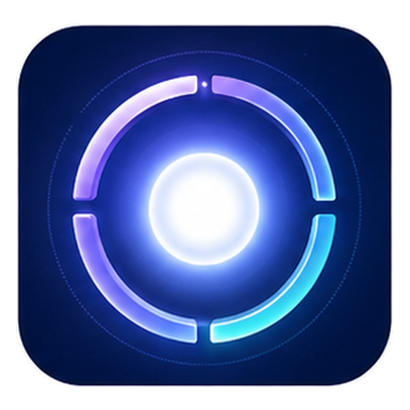
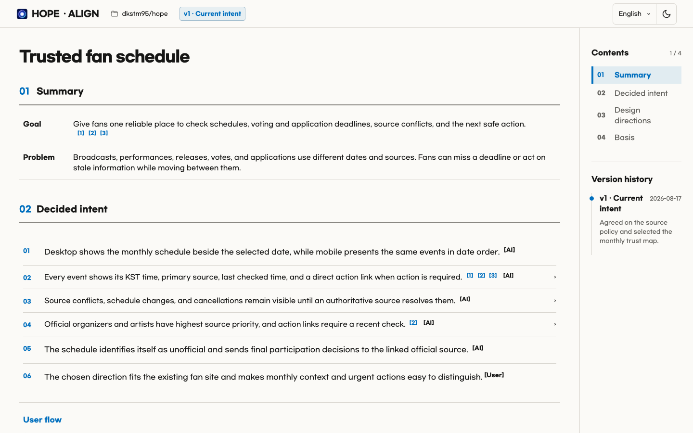
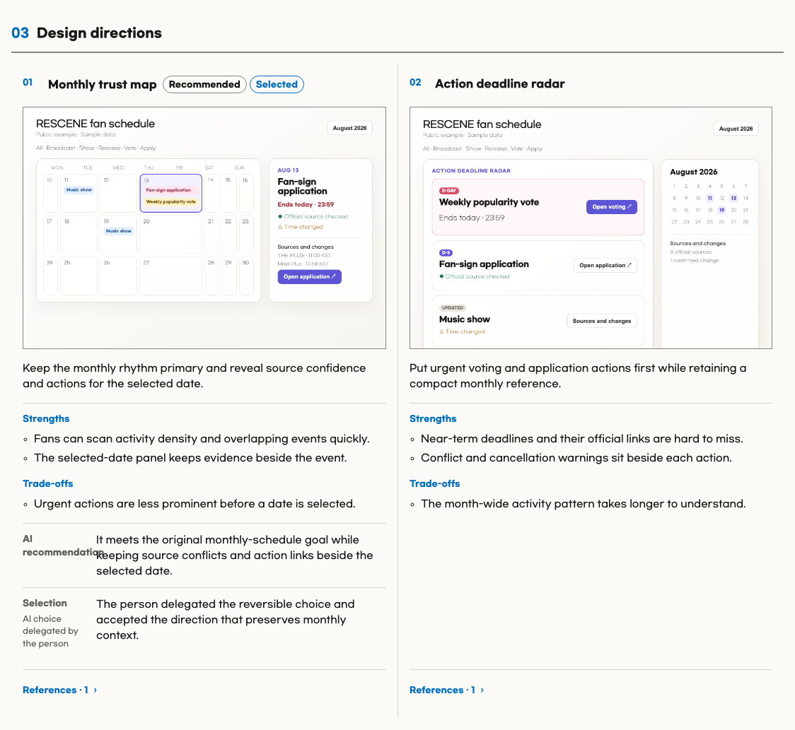
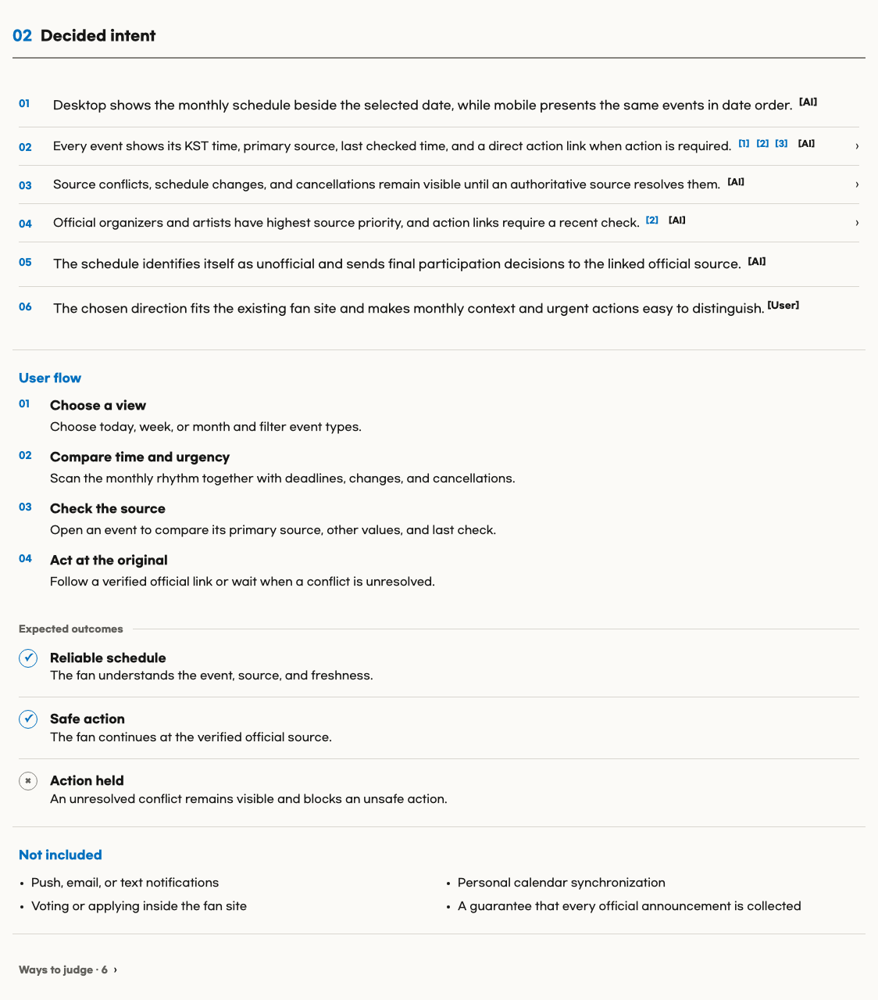
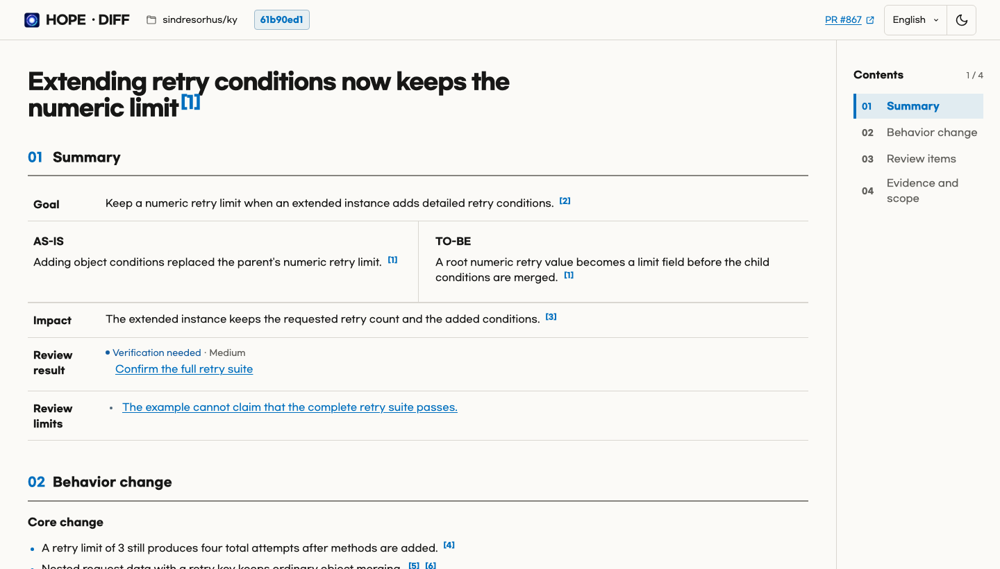
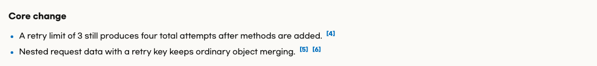
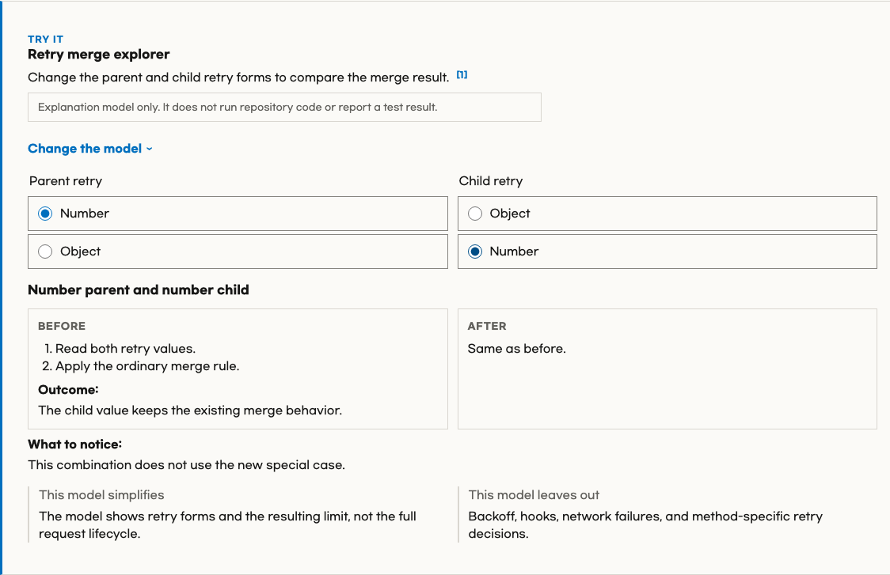
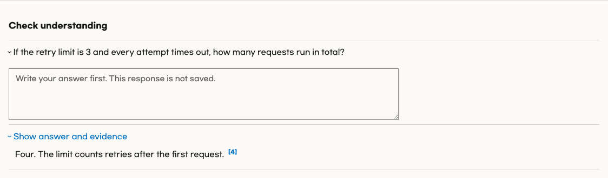

<p align="center">
  
</p>

<h1 align="center">Hope Commit</h1>

<p align="center">
  <strong>
    Review one Git commit as evidence-linked offline HTML while keeping the
    original Hope capabilities available.
  </strong>
</p>

<p align="center"><a href="README.ko.md">한국어</a></p>

<br>

> [!NOTE]
> Hope Commit is an unofficial fork of [Hope](https://github.com/dkstm95/hope)
> by SeungIl. It preserves the original Git history and MIT license. The
> original project does not endorse or maintain this fork.

## Features

### 🧾 Commit Diff — Review one immutable local Git commit

Commit Diff accepts a hexadecimal commit ID and creates one evidence-linked,
self-contained offline HTML review. It compares the commit with its first
parent by default, supports an explicit parent for merge commits, and compares
a root commit with Git's empty tree.

The collector reads committed Git objects instead of the worktree. Staged,
unstaged, and untracked files therefore cannot change the captured review. It
keeps Hope Diff's bounded input, redaction, evidence validation, temporary-state
ownership, and atomic publication guarantees.

Example request:

```text
Use $hope-commit:commit-diff to review commit f6363ced in this repository and create Korean HTML.
```

---

### 🤝 Align — Reach shared understanding before implementation and prevent `intent debt`

Align reviews the request against verifiable evidence and interviews the person
about material gaps, contradictions, risks, unsupported assumptions, edge
cases, and simpler alternatives that could change the result.

When the agreement needs a durable record for later work or review, or the
person asks for an artifact, Align writes one self-contained HTML brief inside
the project. A small, clear task that will continue in the current session can
stay in the conversation without creating a file.

A brief contains one agreed goal and a set of completion criteria. Each
criterion includes how it is verified and who—AI or the person—judges it.
Material changes remain as new versions in the same file, and the document
serves as the implementation contract.

For material UI work without attached references, Align checks the project
first, uses web search when needed, and presents two or three image mockups.

> [!IMPORTANT]
> Generated Align briefs are project documentation. Later version-control work
> includes them with related project changes unless the person excludes them.

**Complete example HTML:** [Open the English Align brief for a fan schedule that
makes source conflicts, changes, cancellations, and verification ownership
explicit.](docs/alignments/rescene-fan-calendar.en.html)

The captures below come from this example. It uses sample data and does not
represent the live `rescene.fan` interface.



<details>
<summary>View detailed Align captures</summary>

| Compared UI directions | Source and lifecycle decisions |
| --- | --- |
| [](assets/readme/hope-align-directions-en.png) | [](assets/readme/hope-align-decisions-en.png) |

</details>

---

### 🔎 Diff — Understand what changed and how to judge it to prevent `cognitive debt`

A code change can be complete while its owner still cannot predict, explain, or
judge it, and that gap is cognitive debt.

Diff creates one HTML artifact that explains behavior before code and links
important claims to evidence.

It may use visuals, a microworld, or a quiz to help the reader explore the
change.

The artifact helps the reader understand and judge the change, then use that
understanding in follow-up decisions and work.

> [!NOTE]
> With no URL, Diff first looks for the current branch's pull request.
> If none exists, it selects your latest open pull request in the repository.
> Run Diff again when the pull request changes.

The captures below come from a fixed English Diff example based on
[Ky PR #867](https://github.com/sindresorhus/ky/pull/867).

**Complete example HTML:** [Open the English Diff artifact for Ky PR #867 with
its retry-configuration microworld and quiz.](docs/diffs/ky-867-retry-extend.en.html)



<details>
<summary>View detailed Diff captures</summary>

| Core change | Interactive microworld |
| --- | --- |
| [](assets/readme/hope-diff-core-en.png) | [](assets/readme/hope-diff-microworld-en.png) |

[](assets/readme/hope-diff-quiz-en.png)

</details>

---

### ⚖️ Toxic Review — Put a work product through a rigorous Red–Blue review

Red finds. Blue challenges. The active agent judges.

Independent Red reviewers probe distinct material risks. When a finding is
consequential or materially uncertain, a fresh Blue verifier sees only the
sealed finding and scoped evidence. Blue tries to disprove it and expose
overstatement or missing context; it does not defend the work product or decide
the result.

The active agent retains final judgment and reports only the findings supported
by the evidence.

> [!TIP]
> Ask Hope to limit the Red reviewer count when you want a smaller routine run.
> Review size alone does not add Blue, but a consequential or materially
> uncertain finding still triggers it.

---

### ✨ Polish — Refine implemented work

Independent review agents look for useful improvements.

For code, they check reuse of existing helpers, simplicity, efficiency, and
abstraction fit.

A fresh finisher judges the results, applies only the improvements that work
together, and verifies the result.

Polish does not hunt for bugs, develop features, perform migrations, or handle
broad maintenance.

---

### 🧹 Sweep — Clean up a codebase

Sweep performs a read-only review of a codebase.

It looks for broken references, stale code, unsupported abstractions,
verification gaps, dependency or license risk, delivery waste, unclear
ownership, and similar maintenance risks.

Select a candidate from the review results to start work.

---

### ✍️ Write — Make language clearer without losing meaning

Hope also uses Write within other tasks, including implementation and other
Skills.

Write's shared standard adapts George Orwell's six rules in
[Politics and the English Language](https://www.orwellfoundation.com/the-orwell-foundation/orwell/essays-and-other-works/politics-and-the-english-language/).

<br>

## Install

You need:

- Node.js 22 or newer
- An authenticated [GitHub CLI](https://cli.github.com/) to use PR-based Diff. Run
  `gh auth login` first if needed.

> [!TIP]
> The simplest option is to ask an AI:
>
> ```text
> Install Hope Commit from https://github.com/ljkhyeong/hope-commit for this host.
> Follow the repository README and tell me if I need to restart.
> ```

To install it yourself, run the commands for your host.

For example:

```bash
# Codex
codex plugin marketplace add ljkhyeong/hope-commit
codex plugin add hope-commit@hope-commit
```

```bash
# Claude Code
claude plugin marketplace add ljkhyeong/hope-commit
claude plugin install hope-commit@hope-commit
```

## License

[MIT](LICENSE). See [NOTICE](NOTICE) for original-project attribution and the
bundled font notices under
[`plugins/hope-commit/assets/fonts/`](plugins/hope-commit/assets/fonts/).
