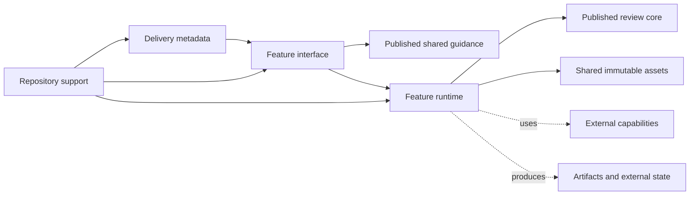

# Hope architecture

This document is Hope's long-term structure contract. People and agents must
preserve its layer responsibilities and dependency directions.

It records only stable structure. Product direction, visual contracts, release
rules, and work procedures belong to [PRINCIPLES.md](../PRINCIPLES.md),
[design.md](design.md), [release.md](release.md), and
[CONTRIBUTING.md](../CONTRIBUTING.md). Feature inventories, tool instructions,
and enforcement mechanisms also stay outside this document.

## Layers and responsibilities

### Delivery metadata

Delivery metadata exposes Hope's features to a host. It may depend on a feature
interface but cannot define feature behavior. Feature sources do not depend on
delivery metadata.

### Feature interface

Each feature has one editable Skill boundary. That boundary owns the feature's
behavior, model judgment, conversation flow, and private guidance.

Published shared guidance owns only invariants used across feature boundaries.
A feature does not depend on another feature's private source.

### Feature runtime

A feature owns the deterministic runtime needed to control external state or
produce a deterministic result.

Runtime source stays inside its feature boundary and does not depend on a
sibling feature or repository support. It may depend on Hope-wide immutable
assets.

Diff and Commit Diff also depend on `plugins/hope/review-core/`. This published
shared runtime contains only the canonical JSON hash, evidence-range splitting,
text and redaction safety, review-result derivation, and bounded structured
input used by both features. Collection, workflow, state, rendering, and
publication remain inside the owning feature.

Any other cross-feature source dependency requires an explicit shared contract
and must satisfy the shared-source rule in
[PRINCIPLES.md](../PRINCIPLES.md#keep-each-feature-close-together).

### Repository support

Repository support builds and verifies delivery metadata, feature interfaces,
and feature runtime. Product sources do not depend on repository support.

The package builder is delivery support, not a product runtime or an
independent Hope compiler.

### Runtime effects

Feature contracts own guarantees for external capabilities, temporary state,
safe publication, and generated artifacts. Runtime effects are not repository
source dependencies.

## Dependency direction

Solid arrows point from repository sources to their source dependencies.
Dotted arrows point from runtime to effects owned by the feature contract.

## Enforcement boundary

CI verifies the source dependencies that can be determined mechanically. The
executable checks own their detection mechanisms.

Human review and behavior-focused tests own semantic responsibilities and
runtime guarantees that source dependency checks cannot decide.
