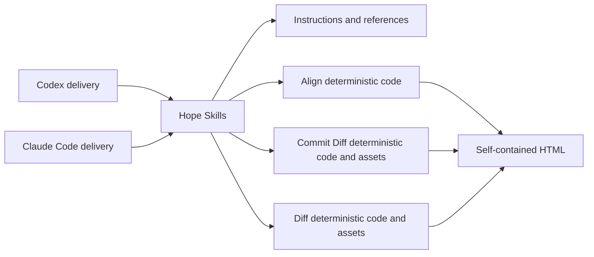

# Hope architecture

Hope is a set of focused features for working with AI.

This repository currently distributes those features as one plugin for Codex
and Claude Code.

Delivery exposes Hope but does not define feature behavior.

There is no independent Hope CLI or harness.

## Sources of truth

- [PRINCIPLES.md](../PRINCIPLES.md) defines the project direction.
- Each `plugins/hope-commit/skills/<feature>/SKILL.md` defines one feature's behavior.
- A Skill's `references/` directory owns detailed or conditional guidance.
- [design.md](design.md) defines Hope's GUI guidance and the Align, Diff, and
  Commit Diff artifact visual contracts.
- [release.md](release.md) defines the public package and release process.
- This document defines repository structure and dependency boundaries.

The `docs/` directory is for topic-specific repository contracts that become
relevant after the kind of work is known.

It must not contain another description of behavior already owned by a Skill.

A separate audience is not enough reason to keep parallel behavior text.

Link to the authoritative source unless another document owns a distinct
contract or obligation.

## Dependency direction



The arrows point from delivery toward feature behavior.

Manifests and marketplace metadata may describe discovery but must not define a
different feature.

Each Skill's `agents/openai.yaml` is also delivery metadata. It must describe
the owning Skill and cannot add or change feature behavior.

Feature references and scripts must not read a plugin manifest, marketplace
configuration, installed-cache path, or host-specific root variable.

Keep host-specific path resolution in `SKILL.md` or repository tooling.

Use delivery-neutral language for feature judgment and workflow rules.

## Folders

```text
hope-commit/
├── .agents/             Codex local marketplace catalog
├── .claude-plugin/      Claude local marketplace catalog
├── assets/              README captures
├── docs/                Topic-specific repository, release, and design contracts
├── e2e/                 Browser acceptance tests
├── plugins/hope-commit/ Installable Codex and Claude package
├── test/                Deterministic and package tests
├── test-support/        Shared deterministic test fixtures
└── tools/               Build, validation, staging, and release scripts
```

Keep a Markdown file at the repository root when a tool or common convention
expects it there, or when nearly every contribution must find it before the
kind of work is known.

Keep a topic-specific repository contract under `docs/` even when it governs
several folders or the whole repository within that topic.

Keep directory-local guidance beside the files it governs.

Do not choose a location from importance or file size alone.

## Feature boundary

The current editable source of every feature lives under
`plugins/hope-commit/skills/`.

```text
plugins/hope-commit/
├── .codex-plugin/plugin.json
├── .claude-plugin/plugin.json
├── assets/
└── skills/
    ├── align/
    │   ├── SKILL.md
    │   ├── references/
    │   └── scripts/
    ├── diff/
    │   ├── SKILL.md
    │   ├── references/
    │   ├── scripts/
    │   └── assets/
    ├── commit/
    │   ├── SKILL.md
    │   ├── references/
    │   ├── scripts/
    │   └── assets/
    ├── polish/
    │   ├── SKILL.md
    │   └── references/
    ├── sweep/
    │   └── SKILL.md
    ├── toxic-review/
    │   ├── SKILL.md
    │   └── references/
    └── write/
        ├── SKILL.md
        └── references/
```

Keep model judgment and conversation flow in a concise `SKILL.md`.

Put long or conditional guidance in `references/` and load it only when needed.

Add `scripts/` only when code must control external state or a deterministic
result.

Keep private assets beside their only feature consumer.

Do not generate Skill instructions or keep a repository mirror of them.

Shared code needs two real consumers with the same invariant. Align, Diff, and
Commit Diff currently own their visual tokens, rendering, and publication
behavior independently. Commit Diff started from Diff's bounded review design,
but does not import Diff at runtime.

Do not add a generic runner, manager, registry, state machine, compatibility
layer, or second delivery path for a possible future need.

If another delivery form earns its place, reorganize the feature without
rewriting its behavior.

## Deterministic code boundary

Align, Diff, and Commit Diff currently need deterministic code.

Their scripts live beside their owning Skills and do not form a shared runtime.

Each Skill and its references own workflow and model judgment.

Align's scripts own bounded structured input, HTML identity, rendering, safe
project publication, and same-artifact revision. Diff's scripts own external
source identity, bounds, validation, rendering, temporary state, and
publication. Commit Diff owns local Git commit resolution, parent selection,
immutable object collection, revalidation, rendering, temporary state, and
publication.

[Align's artifact contract](../plugins/hope-commit/skills/align/references/artifact.md)
and [Diff's runtime contract](../plugins/hope-commit/skills/diff/references/runtime.md)
and [Commit Diff's runtime contract](../plugins/hope-commit/skills/commit/references/runtime.md)
define the feature-specific guarantees enforced at those boundaries.

Extract shared code only after another feature needs the same invariant.

## Package boundary

Both host manifests point at the same `skills/` directory.

Skill instructions, references, scripts, schemas, locales, and private assets
ship directly from their editable paths.

Hope-wide brand fonts and the product icon live under `plugins/hope-commit/assets/`
because Align, Diff, and Commit Diff embed the same fixed files. Each feature
renderer still owns its HTML, CSS, layout, and use of those assets.

`tools/build-plugin.mjs` copies the root `LICENSE` and `NOTICE` into the package.

`tools/plugin-files.mjs` records that source mapping and derives the exact
package allowlist in `tools/plugin-package-files.txt`.

An unrelated file under `plugins/hope-commit/` cannot enter a release accidentally.

Do not edit generated package files by hand.

## Verification

- Skill tests cover discovery metadata and packaged references.
- Node tests cover Align identity, revisions, rendering, and safe publication;
  Diff parsing, snapshots, citations, rendering, stale-source checks, bounded
  input, temporary-state ownership, and safe publication; and Commit Diff's
  commit resolution, root and merge handling, immutable blobs, renames, and
  exact-revision context collection.
- Browser tests cover the original artifacts' layout, keyboard behavior,
  accessibility, responsive navigation, printing, and no-JavaScript reading.
- Package tests cover direct Skill sources, the generated license, and the
  exact release allowlist.

Linux runs the deterministic suite on Node.js 22 and 24.

macOS and Windows run focused Node.js 22 package and path smoke tests.

Representative prompts for instruction-led Skills are development and product
smoke checks, not automated release gates.

Skill discovery and manifest validation do not prove feature behavior.

## Changing Hope

Start with a clear user goal and edit the matching Skill directly.

Add a reference only for conditional detail and a script only for a
deterministic or external-state boundary.

Update the README when user-facing capability changes.

Add or change a document under `docs/` only for a cross-feature, repository,
release, or visual contract that has no existing owner.

Test discovery and every deterministic promise that remains.
